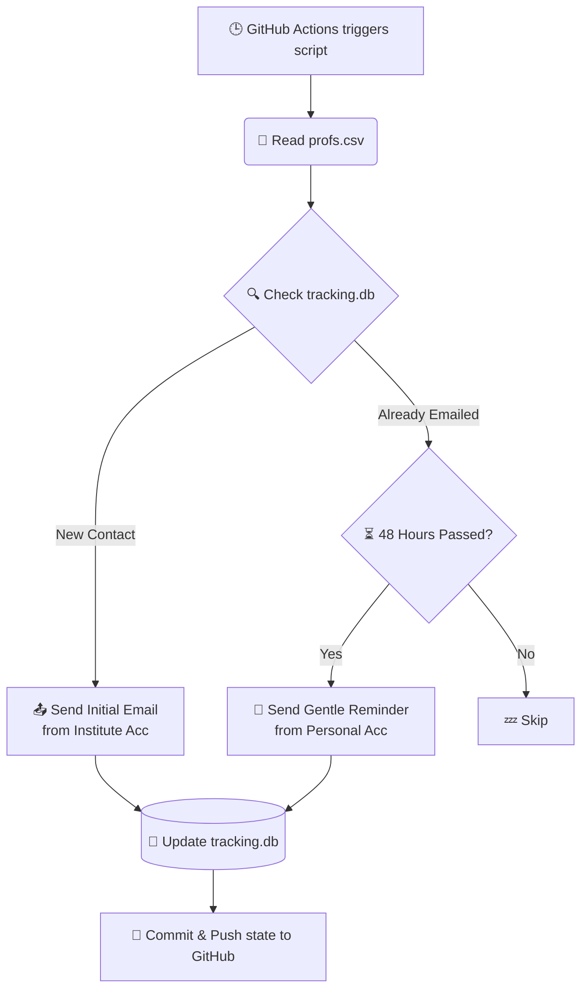

# 🚀 Internship Email Automation System

An automated, hands-off system designed to manage and send cold emails and follow-ups to professors for internship opportunities. Built with Python and powered by GitHub Actions.

---

## 🌟 How It Works



1. **Scheduling**: A GitHub Actions workflow runs the script automatically every 12 hours.
2. **Data Ingestion**: The script reads your target list from `profs.csv`.
3. **State Management**: It checks a local SQLite database (`tracking.db`) to see if an email has already been sent to a specific professor.
4. **Action (Initial)**: If the professor is not in the database, it sends the *Initial Email* from your **Institute Email** and CCs your Personal Email.
5. **Action (Follow-up)**: If the professor is in the database, it checks the timestamp. If 48 hours have passed and they haven't replied, it sends a *Gentle Reminder* from your **Personal Email** (up to 3 times max).
6. **State Persistence**: The script updates `tracking.db` and GitHub Actions automatically commits and pushes this updated database back to your repository so the state is saved for the next run.

---

## 📁 File Structure

```text
📂 internship_automation/
├── 🐍 email_automation.py    # The core logic: reads CSV, manages DB, and sends emails.
├── 👥 profs.csv              # Your contact list: add professors here!
├── 🗄️ tracking.db            # SQLite database tracking email states (auto-generated & auto-updated).
└── ⚙️ .github/
    └── 🤖 workflows/
        └── ⏱️ cron.yml       # GitHub Actions workflow defining the 12-hour schedule.
```

---

## ⚙️ Setup Instructions

### 1. Add Your Contacts
Edit the `profs.csv` file to add the professors you want to contact. Keep the header intact.
```csv
Name,Email,Topic
John Doe,johndoe@university.edu,Machine Learning
```

### 2. Configure GitHub Secrets
For the automation to send emails securely, you must provide your email credentials to GitHub Actions.
Go to your repository **Settings** > **Secrets and variables** > **Actions** > **New repository secret** and add the following:

| Secret Name | Description |
| :--- | :--- |
| `INST_EMAIL` | Your institute/university email address (used for the initial email). |
| `INST_PASS` | Password or **App Password** for your institute email. |
| `PERS_EMAIL` | Your personal email address (used for follow-ups). |
| `PERS_PASS` | Password or **App Password** for your personal email. |

*(Note: If you are using Gmail, Outlook, or Yahoo, you **must** generate an "App Password" from your account security settings to bypass 2-Factor Authentication).*

### 3. Customize Your Templates
Open `email_automation.py` and modify the email subjects and body text to fit your profile and the specific internship you are seeking. Look for these sections:
```python
# Initial Email Template
subject = f"Inquiry regarding Internship Opportunities - {topic}"
body = f"Dear Prof. {name},\n\n..."

# Follow-up Email Template
subject = f"Gentle Follow-up: Internship Opportunities - {topic}"
body = f"Dear Prof. {name},\n\n..."
```

---

## 🛑 Stopping Follow-ups
If a professor replies to you, you need to manually intervene so the bot stops sending them reminders.
Currently, the easiest way is to either:
1. Remove them from `profs.csv`.
2. *(Advanced)* Download `tracking.db`, change their status to `REPLIED` using an SQLite viewer, and push it back to the repository.

---
*Built with ❤️ to make the internship hunt a little less painful.*
