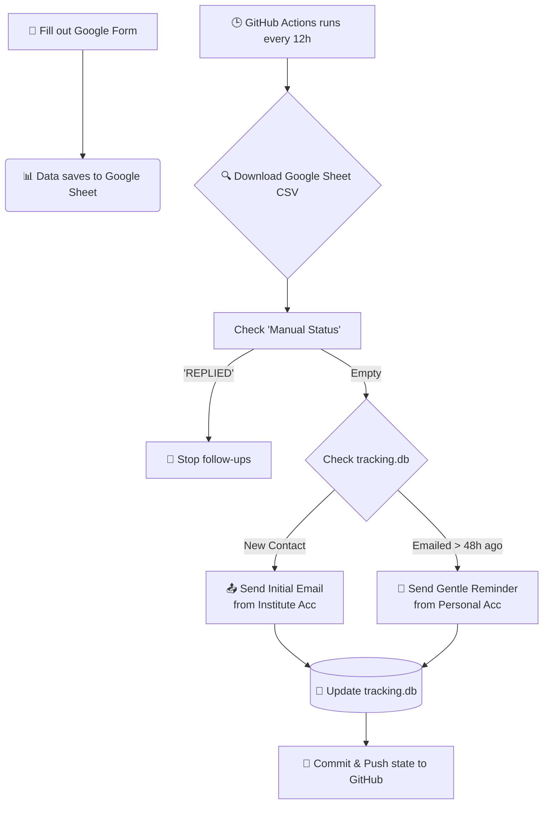

# 🚀 Internship Email Automation System

An automated, hands-off system designed to manage and send cold emails and follow-ups to professors for internship opportunities. Built with Python and powered by GitHub Actions.

---

## 🌟 How It Works



1. **Easy Entry**: You fill out a Google Form on your phone or laptop whenever you find a professor you want to contact.
2. **Scheduling**: A GitHub Actions workflow runs the script automatically every 12 hours.
3. **Fetching Data**: The script securely downloads the latest list of professors from your linked Google Sheet.
4. **Action (Initial)**: If the professor is new, it sends the *Initial Email* from your **Institute Email** and CCs your Personal Email.
5. **Action (Follow-up)**: If the professor has already been emailed and 48 hours have passed, it sends a *Gentle Reminder* from your **Personal Email** (up to 3 times).
6. **Easy Stop**: If a professor replies, you open the Google Sheet on your phone, type `REPLIED` in the "Manual Status" column next to their name, and the script will automatically stop sending them emails.

---

## ⚙️ Setup Instructions

### 1. Set up your Google Form & Sheet
1. Create a new **Google Form** with three "Short answer" questions: `Name`, `Email`, and `Topic`.
2. Go to the **Responses** tab in your Form and click **"Link to Sheets"** (the green spreadsheet icon). Create a new spreadsheet.
3. Open the newly created Google Sheet.
4. Add a new column header to the right of your form questions called `Manual Status`. *(You will type 'REPLIED' in this column when someone responds).*
5. Go to **File > Share > Publish to web**.
6. Change "Entire Document" to the specific sheet name (e.g., "Form Responses 1").
7. Change "Web page" to **"Comma-separated values (.csv)"**.
8. Click **Publish** and **copy the link** it gives you.

### 2. Configure GitHub Secrets
For the automation to access your Sheet and send emails securely, you must add credentials to GitHub Actions.
Go to your repository **Settings** > **Secrets and variables** > **Actions** > **New repository secret** and add the following:

| Secret Name | Description |
| :--- | :--- |
| `SHEET_CSV_URL` | The **Publish to web CSV link** you copied in Step 1. |
| `INST_EMAIL` | Your institute/university email address (used for the initial email). |
| `INST_PASS` | Password or **App Password** for your institute email. |
| `PERS_EMAIL` | Your personal email address (used for follow-ups). |
| `PERS_PASS` | Password or **App Password** for your personal email. |

*(Note: If you are using Gmail, Outlook, or Yahoo, you **must** generate an "App Password" from your account security settings to bypass 2-Factor Authentication).*

### 3. Customize Your Templates
Open `email_automation.py` in your repository and modify the email subjects and body text to fit your profile.
```python
# Initial Email Template
subject = f"Inquiry regarding Internship Opportunities - {topic}"
body = f"Dear Prof. {name},\n\n..."

# Follow-up Email Template
subject = f"Gentle Follow-up: Internship Opportunities - {topic}"
body = f"Dear Prof. {name},\n\n..."
```

---

## 🛑 Stopping Follow-ups
If a professor replies to you, simply open your linked Google Sheet (via the app or web browser), find their row, and type `REPLIED` in the **Manual Status** column. The script will see this on its next run and stop sending them follow-ups.

---
*Built with ❤️ to make the internship hunt a little less painful.*